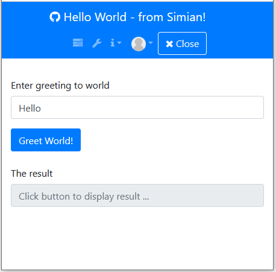
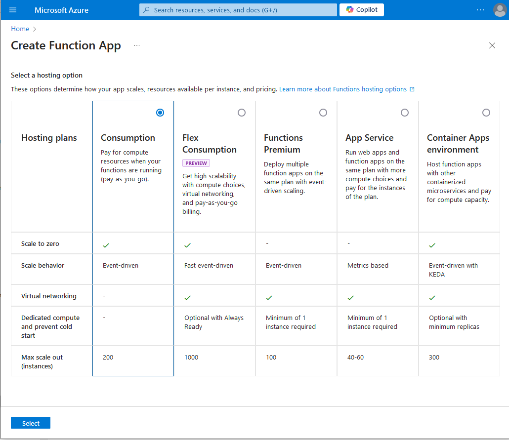
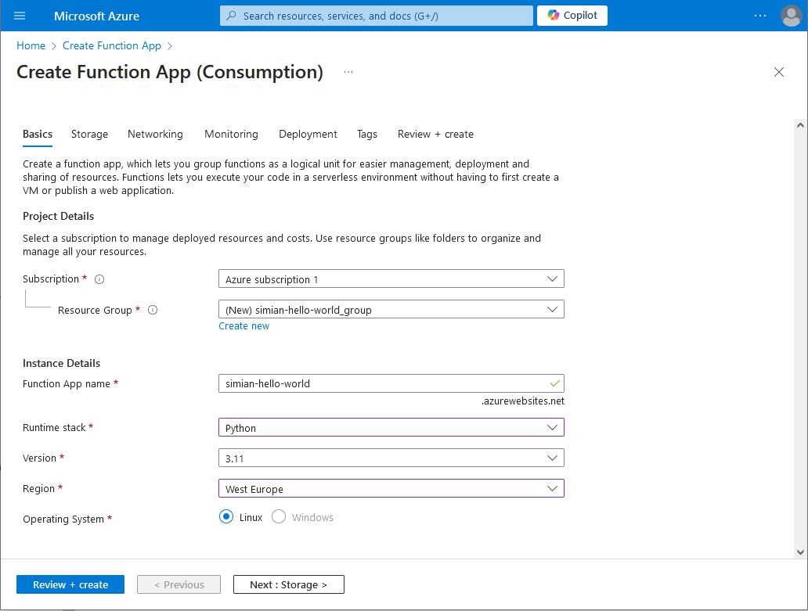
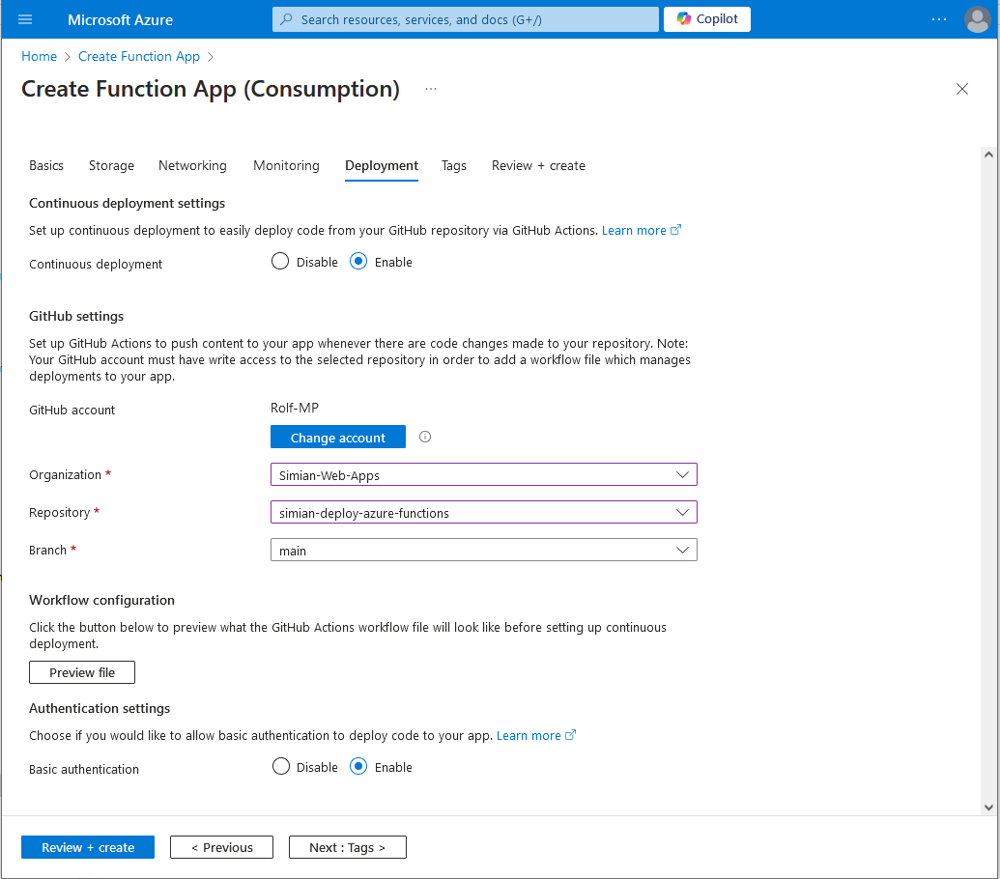
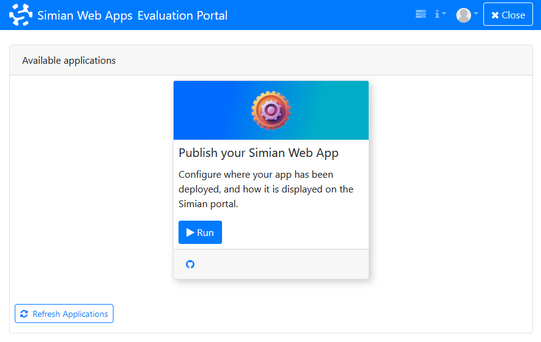
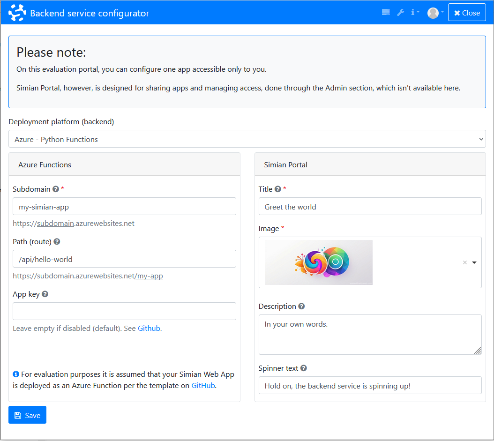
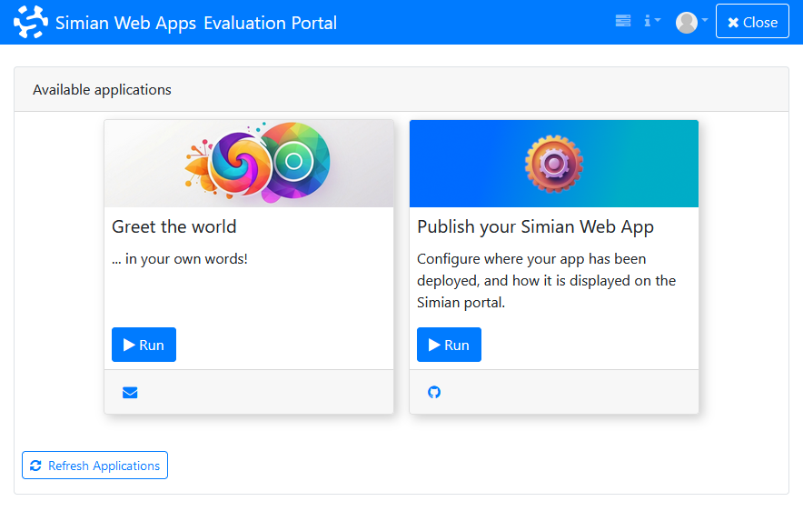

# Deploy your Python Simian Web App on Azure Functions

Deployment of a Simian Web App involves 4 main steps:
1. Get the code (this repo)
2. Deploy your Simian Web App Python code as a web service on a(ny) backend.  
   [Azure](https://portal.azure.com/) offers _**convenient & free**_ hosting Python code as a web service.
   Deployment of the code can be done from within Visual Studio Code or _**directly from GitHub**_ by means of GitHub Actions.   
   This GitHub project, when linked to your Azure Function, automates deployment of Python based Simian Web Apps on Azure.  
   Setting up deployment from GitHub to Azure Function can be done in several ways. This project describes the steps using the Azure Portal.  
   Once set up, updates to your code pushed to GitHub will be automatically deployed to your azurewebsites.net web service.  
   > This way Simian Web App functionality is exposed as a web service.  
   > Source code is under your control and not shared with simiansuite.com.
3. Publish the app on Simian Portal  
   For evaluation purposes, a shared Simian Evaluation Portal where you can configure your own Simian Web App is readily available.  
4. Use your app, live on the web

# 1. The code - repository contents
- Azure Functions build and deploy information is provided in `.github/workflows/main_my-simian-app.yml`.
- Python package installation instructions are provided through `requirements.txt`.
- Azure Function routing and generation of Simian specific startup information in logs is done in `function_app.py`.
- Azure function type and authorization level is set in `function.json`
- Simian Web Apps are placed in the `apps` folder.

## "Hello World!" app included
A basic Simian Web App `hello-world.py` example is included in this repository in the `apps` directory.  
The endpoint to this is example is `https://YOUR_SUBDOMAIN.azurewebsites.net/api/hello-world`

## Add your own app(s)
Additional Simian Web App(s) by adding your Simian Web App module to the `apps` directory.  

It is recommended to name your module in lower case chracters and underscores when needed.  
The route will be the base name of your module `.py` file with underscores (`_`) replaced by dashes (`-`).

The endpoint to a module called `my_first_simian_app.py` stored in the `apps` folder would be `https://YOUR_SUBDOMAIN..azurewebsites.net/api/my-first-simian-app`

# 2. Deploy - to Azure Functions
Fork this repository on GitHub such that you can set it up to build and deploy changes to your own Azure Function.

> If you are new to Azure you will need to create a (free) Azure account.

1. Create a new [Azure Function](https://portal.azure.com/#create/Microsoft.FunctionApp)  
   (A free option is opted for below.)  
   
   Click "Select"
2. Enter your Function App name, choose Python for Runtime stack, and a region near you.
     
3. Navigate to the "Deployment" tab  
   Enable "Continuous deployment"  
   Select your Github account, organization, repository, and branch.  
   Enable "Basic authentication" (otherwise the publish profile will not contain credentials and pushing changes from GitHub will not work)  
    
   Click "Review + create"
3. Click "Create" & and wait for deployment to complete.
4. Click "Go to resource".  
   Take note of the URL of the Azure Function.
5. Click "Get publish profile" and store this publish profile in a secret in your GitHub repository:  
   Under your GitHub repository navigate to `Settings > Security > Secrets and variables > Actions`  
   Under the Secrets tab click "New repository secret"  
   Name: `AZURE_FUNCTIONAPP_PUBLISH_PROFILE`  
   Secret: [the_content_of_the_downloaded_publish_profile_file]  
   Click "Add secret"
6. To test if deployment from GitHub is working, in your Azure Portal, under your Azure Function "Deployment Center" you can click the "Sync" button.  
   In your GitHub Repository you can see the deployment activity and its success or failure under "Actions".  
   If successful, in your Azure Portal you should see "Status: Running" in theOverview page of your Azure Function.

Alternatively, you can clone out this repository and create an Azure Function and deploy code changes from within Microsoft Visual Studio. See [Develop Azure Functions by using Visual Studio Code](https://learn.microsoft.com/en-us/azure/azure-functions/functions-develop-vs-code?tabs=node-v4%2Cpython-v2%2Cisolated-process%2Cquick-create&pivots=programming-language-python)

## Optional: API Key
Azure Functions allow different authorization levels. In this repository the default is "anonymous" as set in the `function.json` file.  
Change "anonymous" to "function" to require an App key to access the Azure Function.  
For usage from Simian Portal a header `x-functions-key` should be set to the value of one of the "App keys" under "Functions" of your Azure Function in Azure Portal. See [Azure Functions - Access key authorization](https://learn.microsoft.com/en-us/azure/azure-functions/functions-bindings-http-webhook-trigger?tabs=python-v2%2Cisolated-process%2Cnodejs-v4%2Cfunctionsv2&pivots=programming-language-python#api-key-authorization)

## Azure Functions scale to 0
Depending on your (free) Azure plan, Azure Functions may spin down after some period of inactivity.
When starting the Simian Web App after such period of inactivity it needs to be spinned up causing a delay. 

Consider upgrading to a paid Azure plan to avoid spinning down.

# 3. Publish - on Simian Evaluation Portal
Publishing your Simian Web App:
1. Sign up at [Simian Evaluation Portal](https://evaluate.simiansuite.com/).  
   (On the evaluation portal your app will only be accessible to you.)   
   When signed in you will see the Publish app.  
     
1. From your Azure deployment, take note of:  
   The _subdomain_ of your backend deployment under _.azurewebsites.net_  
   The _App key_ (if enabled on your Azure Function)  
1. In [Simian Evaluation Portal](https://evaluate.simiansuite.com/), configure and publish app [here](https://evaluate.simiansuite.com/configure_my_app/).  
     
   To configure the included `hello_world.py` app, set:
   - `Subdomain` to the subdomain of your `.azurewebsites.net` web service.  
     (Subdomain is `abc` if your webservice runs on `abc.azurewebsites.net`.)
   - `Route` to the route to the module under the `apps` directory that you want to deploy: `hello-world` for `hello_world.py`.  
     (Route to module is module file name without `.py`, and with `_` replaced by `-`.)
   - Optionally, when authentication level is set to function on your Azure Function, `API Key` to the value of one of the App keys under Function in the Azure Portal under your Azure Function.  
   Then set the title, description, and image to be displayed on the tile representing your app in the portal.

> Simian Portal supports app sharing and access management. Access to your app on [Simian Evaluation Portal](https://evaluate.simiansuite.com/) is restricted to yourself only, and solely serves evaluation purposes.  
> Contact [simiansuite.com](https://simiansuite.com/contact-us/) for Simian Portal cloud, and on-premises options.

> Simian Portal works with a range of backend platforms from docker to Azure, and other cloud providers.
> For evaluation purposes render.com and Azure Functions have been chosen because of convenient deployment paths from code on GitHub to a live web service, its free entry offering and paid upgrade path, and last but not least because your code remains under your control.

# 4. Use the app
Start your app via [Simian Evaluation Portal](https://evaluate.simiansuite.com/).  

You can bookmark your app URL for direct access. 

> The bookmark URL must not contain the `?tab_uuid=...` parameter because `tab_uuid` identifies a specific instance of the app which is cleared when closing the app.

  

